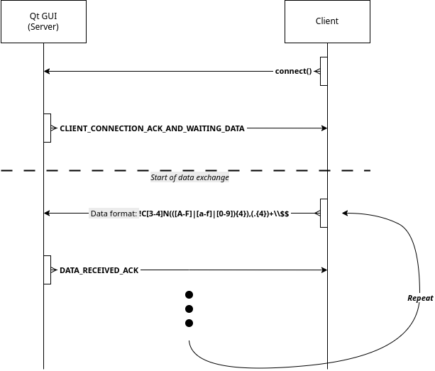

# Protocol

## Basic exchange

TODO:

- DATA_RECEIVED_ACK yet to implement, but works without catching it on the client side for now.

- Security to return GUI_BUSY if one client is already connected yet to implement

Logic:

- Client connects to GUI (Server)

- GUI sends an acknowledgement

- Client sends data

- GUI sends an acknowledgement

## Controlling the LEDs color

Development of the Data format/Regular Expression:

- Must start with '**!**'

- Followed by the components:

  - **C3** => RGB

  - **C4** => RGBW (TODO: Not yet implemented, might be useless)

    - The idea of RGBW is to control the level of white and override the RGB to the W value, simulating a "pure white" channel.

- Next is the number of data to receive :warning: **1 data is an UINT32 => 4 bytes (even in RGB)** :warning:

  - Format is **N** followed by the HEXADECIMAL value from MSB to LSB (reading order)

  - Example for 940 LEDs: !C3**N03AC**...

- To conclude the custom header/prologue, a **comma** is used ('**,**') to separate it from the data

- Now the data can be extracted by groups of 4 bytes:

  - \[0\]: **Red**

  - \[1\]: **Green**

  - \[2\]: **Blue**

  - \[3\]: **White**

- After the last data, a '**$**' must terminate the data sequence

Example:

- For 2x RGB data, the sent packet will look like:

  - !C3N0002,\<R1\>\<G1\>\<B1\>\<W1\>\<R2\>\<G2\>\<B2\>\<W2\>$

## TODO: Add further cmds

TODO: Like; ASK_FOR_NUMBERS_OF_LEDS_IN_DESIGN, ASK_FOR_DESIGN_NAME, ...
