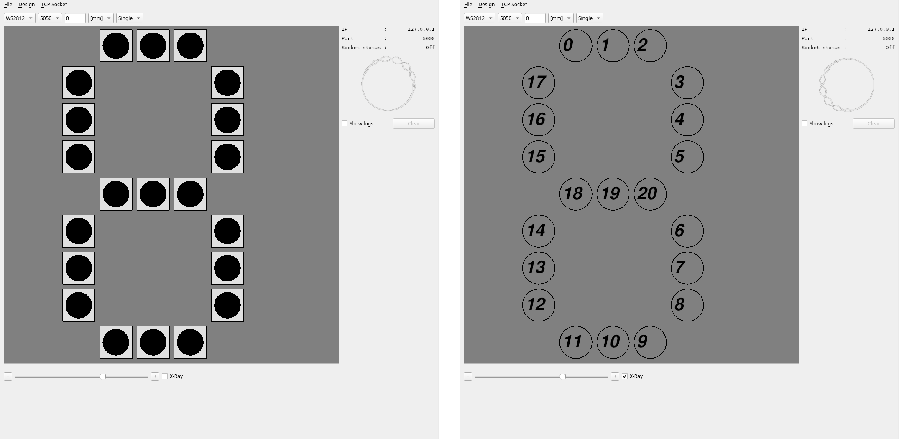

# LEDs Display Creator

## Brief

This tool offers to create a custom LEDs display and to communicate with it, through a TCP socket.

- *How to use it*

- *Protocol implemented*

- **

## Showcase

### X-Ray option

This option allows the user to see each LED's index. Very useful when drawing a design.

### Usage

- Using a design

  

- Creating, Saving & Loading a design

  

## Background

After reproducing the star from Ludens by Bring Me The Horizon, I was struck by the issue of not being able to develop animations on it without having the actual hardware.

This is how I came with the idea of creating this tool that allows to create a LEDs display and communicate with it to create animations, before exporting them to the real deal.

## ...

